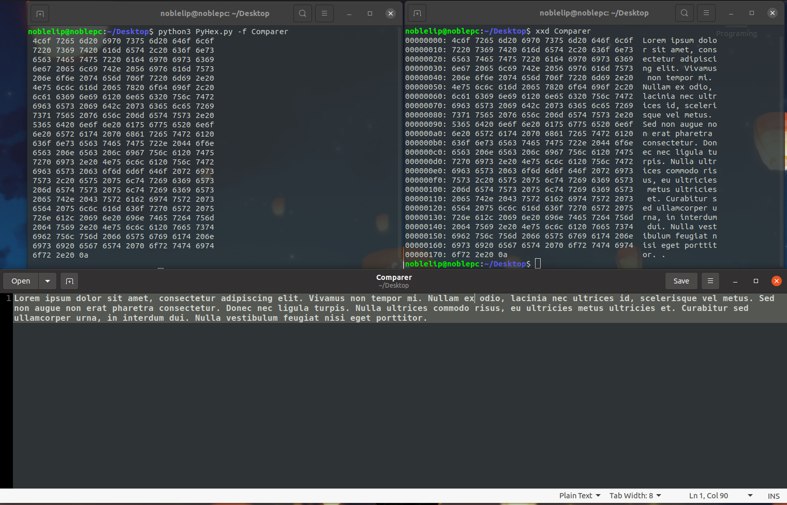

# 🛠️ FileToHex

```
 _____ _ _     _____     _   _           
|  ___(_) | __|_   _|__ | | | | _____  __
| |_  | | |/ _ \| |/ _ \| |_| |/ _ \ \/ /
|  _| | | |  __/| | (_) |  _  |  __/>  < 
|_|   |_|_|\___||_|\___/|_| |_|\___/_/\_\
                                         
```

A super simple but handy Python script to display the hexadecimal (HEX) representation of any file.  
Useful for quick HEX analysis, debugging, or just exploring file contents in a readable format.

## ✨ Features

- 📄 Converts any file to a formatted HEX dump
- 🧑‍💻 Shows both HEX and ASCII representation side by side
- 🏷️ Displays offsets for easy navigation
- 🖥️ Command-line interface

## 🚀 Usage

1. **Run the script with the `-f` flag and your file name:**

   ```sh
   python3 PyHex.py -f <filename>
   ```

   Example:
   ```sh
   python3 PyHex.py -f example.txt
   ```

2. **Output:**  
   The script prints the HEX dump to your terminal, similar to classic hex editors.

   


## 📦 Files

- `PyHex.py` — The main script
- `Git.png` — Example output screenshot
- `README.md` — This file

## 📝 Notes

- The script reads files using `latin1` encoding to support binary data.
- Only for educational and quick-inspection purposes; not a replacement for full-featured hex editors.


